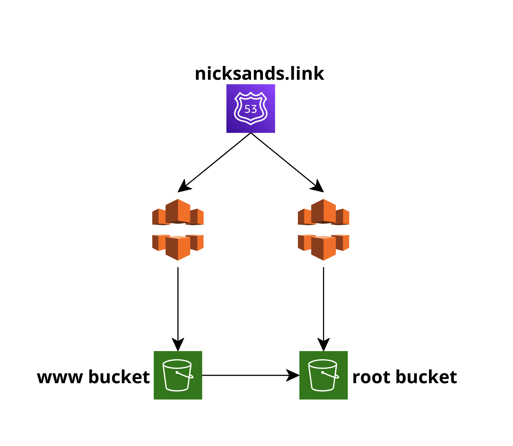

# Static Website Deployed Using Terraform
 
 
 
 In this repository, you'll find the files needed to provision a static website using Terraform and Amazon Web Services
 
 The services used are:
 * Amazon S3
 * CloudFront
 * Route 53
 * Amazon Certificate Manager
 
 A tutorial can be found on my Medium blog [here](https://medium.com/@nicksanders41/deploying-static-website-with-terraform-using-amazon-s3-cloudfront-and-route-53-fe654aa9388)
